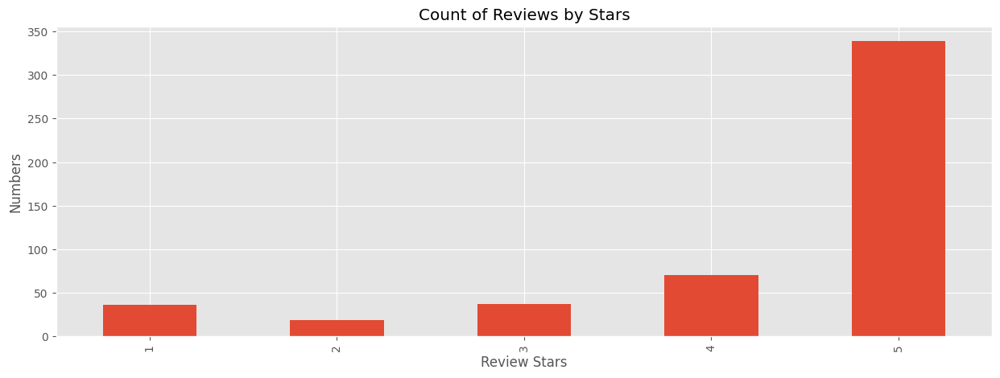
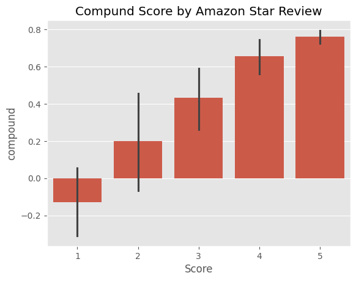
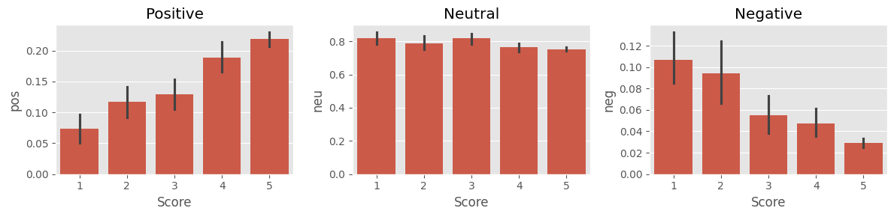
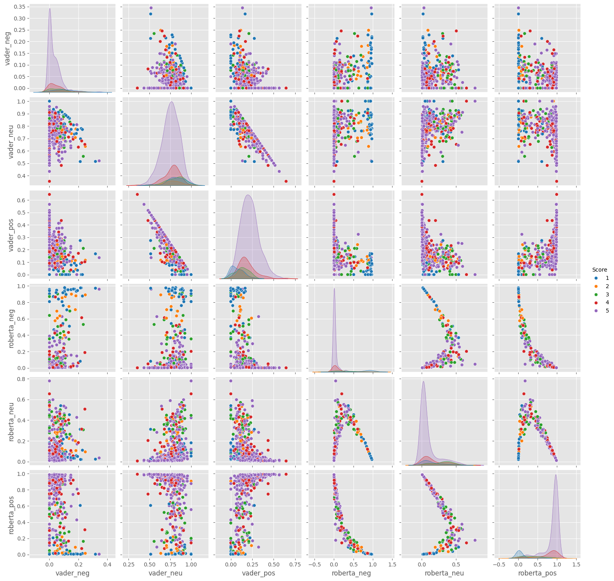

# পাইথনে সেন্টিমেন্ট এনালাইসিস

এখানে  রকম টুল ব্যাবহার করে আমরা আমাজন ফুডের রিভিউ এর ডাটা সেটের সেন্টিমেন্ট এনালাইসিস করব

1. VADER (Valence Aware Dictionary and sEntiment Reasoner) - Bag of words approach
2. Roberta Pretrained Model from 🤗

# শুরুতেই লাইব্রেরি গুলো ইম্পোর্ট করে নিচ্ছি 


```python
#ডাটা ফ্রেমের জন্য পান্ডাস নিচ্ছি
import pandas as pd
# ক্যালকুলেশনের জন্য নামপাই 
import numpy as np
# গ্রাফিক্যাল এনালাইসিস এর জন্য ম্যাটপ্‌লট লাইব্রেরি 
import matplotlib.pyplot as plt
# একই সাথে সিবর্ণ
import seaborn as sns

plt.style.use('ggplot')

# ডাটা প্রসেসের জন্য এন এল টি কে লাইব্রেরি নিচ্ছি
import nltk

```


```python
# শুরুতেই পান্ডার ডাটা ফ্রেমে সিএসভি ফাইল টা ইম্পোর্ট করে নেই
df = pd.read_csv('/mnt/Work/raw_manjaro/database/Reviews.csv')
# ডাটার শেইপ দেখার জন্য 
print(df.shape)


df = df.head(500)
print(df.shape)
```

    (568454, 10)
    (500, 10)


```python
df.head(500)
```


<div>
<style scoped>
    .dataframe tbody tr th:only-of-type {
        vertical-align: middle;
    }

    .dataframe tbody tr th {
        vertical-align: top;
    }

    .dataframe thead th {
        text-align: right;
    }
</style>
<table border="1" class="dataframe">
  <thead>
    <tr style="text-align: right;">
      <th></th>
      <th>Id</th>
      <th>ProductId</th>
      <th>UserId</th>
      <th>ProfileName</th>
      <th>HelpfulnessNumerator</th>
      <th>HelpfulnessDenominator</th>
      <th>Score</th>
      <th>Time</th>
      <th>Summary</th>
      <th>Text</th>
    </tr>
  </thead>
  <tbody>
    <tr>
      <th>0</th>
      <td>1</td>
      <td>B001E4KFG0</td>
      <td>A3SGXH7AUHU8GW</td>
      <td>delmartian</td>
      <td>1</td>
      <td>1</td>
      <td>5</td>
      <td>1303862400</td>
      <td>Good Quality Dog Food</td>
      <td>I have bought several of the Vitality canned d...</td>
    </tr>
    <tr>
      <th>1</th>
      <td>2</td>
      <td>B00813GRG4</td>
      <td>A1D87F6ZCVE5NK</td>
      <td>dll pa</td>
      <td>0</td>
      <td>0</td>
      <td>1</td>
      <td>1346976000</td>
      <td>Not as Advertised</td>
      <td>Product arrived labeled as Jumbo Salted Peanut...</td>
    </tr>
    <tr>
      <th>2</th>
      <td>3</td>
      <td>B000LQOCH0</td>
      <td>ABXLMWJIXXAIN</td>
      <td>Natalia Corres "Natalia Corres"</td>
      <td>1</td>
      <td>1</td>
      <td>4</td>
      <td>1219017600</td>
      <td>"Delight" says it all</td>
      <td>This is a confection that has been around a fe...</td>
    </tr>
    <tr>
      <th>3</th>
      <td>4</td>
      <td>B000UA0QIQ</td>
      <td>A395BORC6FGVXV</td>
      <td>Karl</td>
      <td>3</td>
      <td>3</td>
      <td>2</td>
      <td>1307923200</td>
      <td>Cough Medicine</td>
      <td>If you are looking for the secret ingredient i...</td>
    </tr>
    <tr>
      <th>4</th>
      <td>5</td>
      <td>B006K2ZZ7K</td>
      <td>A1UQRSCLF8GW1T</td>
      <td>Michael D. Bigham "M. Wassir"</td>
      <td>0</td>
      <td>0</td>
      <td>5</td>
      <td>1350777600</td>
      <td>Great taffy</td>
      <td>Great taffy at a great price.  There was a wid...</td>
    </tr>
    <tr>
      <th>...</th>
      <td>...</td>
      <td>...</td>
      <td>...</td>
      <td>...</td>
      <td>...</td>
      <td>...</td>
      <td>...</td>
      <td>...</td>
      <td>...</td>
      <td>...</td>
    </tr>
    <tr>
      <th>495</th>
      <td>496</td>
      <td>B000G6RYNE</td>
      <td>APGAA43E3WPN7</td>
      <td>Darren</td>
      <td>0</td>
      <td>0</td>
      <td>5</td>
      <td>1201392000</td>
      <td>amazing chips</td>
      <td>i rarely eat chips but i saw these and tried t...</td>
    </tr>
    <tr>
      <th>496</th>
      <td>497</td>
      <td>B000G6RYNE</td>
      <td>ABR7HU5H1KNE</td>
      <td>Keith</td>
      <td>0</td>
      <td>0</td>
      <td>5</td>
      <td>1196726400</td>
      <td>Best Chip Ever</td>
      <td>This is easily the best potato chip that I hav...</td>
    </tr>
    <tr>
      <th>497</th>
      <td>498</td>
      <td>B000G6RYNE</td>
      <td>AJQD2WWJYOYFQ</td>
      <td>bubbles</td>
      <td>0</td>
      <td>0</td>
      <td>4</td>
      <td>1186617600</td>
      <td>Tangy, spicy, and sweet- oh my!</td>
      <td>Kettle Chips Spicy Thai potato chips have the ...</td>
    </tr>
    <tr>
      <th>498</th>
      <td>499</td>
      <td>B000G6RYNE</td>
      <td>A16YH487W9ZYO0</td>
      <td>Bruce G. Lindsay</td>
      <td>0</td>
      <td>0</td>
      <td>4</td>
      <td>1184198400</td>
      <td>An indulgence with a bite</td>
      <td>Okay, I should not eat potato chips, nor shoul...</td>
    </tr>
    <tr>
      <th>499</th>
      <td>500</td>
      <td>B000G6RYNE</td>
      <td>A83YQC1XOU4CS</td>
      <td>J. Baker</td>
      <td>0</td>
      <td>0</td>
      <td>5</td>
      <td>1183420800</td>
      <td>The best I've had</td>
      <td>I don't write very many reviews but I have to ...</td>
    </tr>
  </tbody>
</table>
<p>500 rows × 10 columns</p>
</div>


## ডাটা সেটটা কেমন দেখার জন্য রিভিউ গুলোকে গ্রাফে প্লট করে নিচ্ছি

### শুরুতে ডাটা ফ্রেমের একটা কলাম লক করলাম। স্কোর কলাম টা লক করার জন্য
df['Score']
### এর ভ্যালু কাউন্ট করার জন্য 
value_counts()
### একে ভ্যালু অনুযায়ী ইন্ডেক্সিং করলাম
sort_index()
### ইনডেক্স কে প্লট করার জন্য 
.plot ব্যাবহার করলাম


### প্লটকে মডিফাই করার জন্য
plot টাইপ হিসেবে বার চার্ট নিচ্ছি 
.plot(kind='bar')
,title='TITLE NAME',
figsize=(10,5)

#### এক্স অক্ষের লেবেল নাম দিচ্ছি
ax.set_xlabel('LABEL NAME')

## প্লট শো করার জন্য 
plt.show()


```python
ax = df['Score'].value_counts().sort_index() \
    .plot(kind='bar',
          title='Count of Reviews by Stars',
          figsize=(15, 5))
ax.set_xlabel('Review Stars')
ax.set_ylabel('Numbers')
plt.show()
```


    

    


```python

```

## Basic NLTK

### যে ডাটা নিয়ে কাজ করছি সেটা টেক্সট ডাটা। যেকোনো এক্টা টেক্সট ডাটাকে রিড করার জন্য ডাটা ফ্রেমের কলাম থেকে যেকোনো এক্টা রো সিলেক্ট করছি


```python
example = df['Text'][50]
print(example)
```

    This oatmeal is not good. Its mushy, soft, I don't like it. Quaker Oats is the way to go.


```python
examaple2 = df['Text'][111]
print(examaple2)
```

    I have been drinking this tea for a long time now.  I used to have to purchase it at a doctor's office because it wasn't available elsewhere.  I'm so glad that I can buy it now from Amazon.com.  I drink this tea throughout the day like other folks drink coffee.  Wonderful taste.


### টেক্সট কে টোকেনাইজ করে নিচ্ছি। টোকেনাইজেশন হলো পুরো টেক্সটকে ছোট ছোট ওয়ার্ডে স্প্লিট করে নেয়া


```python
tokens = nltk.word_tokenize(example)
tokens[:10]
```


    ['This', 'oatmeal', 'is', 'not', 'good', '.', 'Its', 'mushy', ',', 'soft']


### প্রত্যেকটা টোকেন কোন পার্টস অফ স্পিচ সেটা দেখে নিচ্ছি


```python
tagged = nltk.pos_tag(tokens)
tagged[:10]
```


    [('This', 'DT'),
     ('oatmeal', 'NN'),
     ('is', 'VBZ'),
     ('not', 'RB'),
     ('good', 'JJ'),
     ('.', '.'),
     ('Its', 'PRP$'),
     ('mushy', 'NN'),
     (',', ','),
     ('soft', 'JJ')]


## টোকেন গুলোকে একত্রে করে গ্রুপ করে নেয়ার জন্য চাঙ্কিং করছি 


```python
entities = nltk.chunk.ne_chunk(tagged)
entities.pprint()
```

    (S
      This/DT
      oatmeal/NN
      is/VBZ
      not/RB
      good/JJ
      ./.
      Its/PRP$
      mushy/NN
      ,/,
      soft/JJ
      ,/,
      I/PRP
      do/VBP
      n't/RB
      like/VB
      it/PRP
      ./.
      (ORGANIZATION Quaker/NNP Oats/NNPS)
      is/VBZ
      the/DT
      way/NN
      to/TO
      go/VB
      ./.)


# Step 1. VADER সেন্টিমেন্ট স্কোরিং
VADER( Valence Aware Dictionary for Sentiment Reasoning)

এই সিস্টেমে প্রত্যেক্টা ওয়ার্ডের জন্য এক্টা করে ভ্যালু প্রি ডিফাইন্ড করা আছে। ওয়ার্ড সর্ট করে সেখানে পজেটিভ, নেগেটিভ , নিউট্রাল বেসিসে স্কোরিং করে এই 

We will use NLTK's `SentimentIntensityAnalyzer` to get the neg/neu/pos scores of the text.

- এটা এক্টা ব্যাগ অফ ওয়ার্ড এপ্রোচ, এখানে:
    1. প্রথমে স্টপ ওয়ার্ড গুলো বাদ দিতে হবে। স্টপ ওয়ার্ড গুলো বেসিক and, or ,but যাতীয় ওয়ার্ড
    2. প্রত্যেক ওয়ার্ড কে স্কোর করে ফাইনাল স্কোর বের করা হবে


```python
from nltk.sentiment import SentimentIntensityAnalyzer
from tqdm.notebook import tqdm

sia = SentimentIntensityAnalyzer()
```


```python
sia.polarity_scores('I am so happy!')
```


    {'neg': 0.0, 'neu': 0.318, 'pos': 0.682, 'compound': 0.6468}


```python
sia.polarity_scores('This is the worst thing ever.')
```


    {'neg': 0.451, 'neu': 0.549, 'pos': 0.0, 'compound': -0.6249}


```python
sia.polarity_scores(example)
```


    {'neg': 0.22, 'neu': 0.78, 'pos': 0.0, 'compound': -0.5448}


```python
sia.polarity_scores(examaple2)
```


    {'neg': 0.0, 'neu': 0.81, 'pos': 0.19, 'compound': 0.8769}


```python
# পুরো ডাটা সেটে পোলারিটি স্কোর নিয়ে নিচ্ছি এখন
res = {}
for i, row in tqdm(df.iterrows(), total=len(df)):
    text = row['Text']
    myid = row['Id']
    res[myid] = sia.polarity_scores(text)
```


      0%|          | 0/500 [00:00<?, ?it/s]


```python
vaders = pd.DataFrame(res).T
vaders = vaders.reset_index().rename(columns={'index': 'Id'})
vaders = vaders.merge(df, how='left')
```


```python
# সব ডাটা স্কোর করা হয়েছে। দেখে নিই
vaders.head()
```


<div>
<style scoped>
    .dataframe tbody tr th:only-of-type {
        vertical-align: middle;
    }

    .dataframe tbody tr th {
        vertical-align: top;
    }

    .dataframe thead th {
        text-align: right;
    }
</style>
<table border="1" class="dataframe">
  <thead>
    <tr style="text-align: right;">
      <th></th>
      <th>Id</th>
      <th>neg</th>
      <th>neu</th>
      <th>pos</th>
      <th>compound</th>
      <th>ProductId</th>
      <th>UserId</th>
      <th>ProfileName</th>
      <th>HelpfulnessNumerator</th>
      <th>HelpfulnessDenominator</th>
      <th>Score</th>
      <th>Time</th>
      <th>Summary</th>
      <th>Text</th>
    </tr>
  </thead>
  <tbody>
    <tr>
      <th>0</th>
      <td>1</td>
      <td>0.000</td>
      <td>0.695</td>
      <td>0.305</td>
      <td>0.9441</td>
      <td>B001E4KFG0</td>
      <td>A3SGXH7AUHU8GW</td>
      <td>delmartian</td>
      <td>1</td>
      <td>1</td>
      <td>5</td>
      <td>1303862400</td>
      <td>Good Quality Dog Food</td>
      <td>I have bought several of the Vitality canned d...</td>
    </tr>
    <tr>
      <th>1</th>
      <td>2</td>
      <td>0.138</td>
      <td>0.862</td>
      <td>0.000</td>
      <td>-0.5664</td>
      <td>B00813GRG4</td>
      <td>A1D87F6ZCVE5NK</td>
      <td>dll pa</td>
      <td>0</td>
      <td>0</td>
      <td>1</td>
      <td>1346976000</td>
      <td>Not as Advertised</td>
      <td>Product arrived labeled as Jumbo Salted Peanut...</td>
    </tr>
    <tr>
      <th>2</th>
      <td>3</td>
      <td>0.091</td>
      <td>0.754</td>
      <td>0.155</td>
      <td>0.8265</td>
      <td>B000LQOCH0</td>
      <td>ABXLMWJIXXAIN</td>
      <td>Natalia Corres "Natalia Corres"</td>
      <td>1</td>
      <td>1</td>
      <td>4</td>
      <td>1219017600</td>
      <td>"Delight" says it all</td>
      <td>This is a confection that has been around a fe...</td>
    </tr>
    <tr>
      <th>3</th>
      <td>4</td>
      <td>0.000</td>
      <td>1.000</td>
      <td>0.000</td>
      <td>0.0000</td>
      <td>B000UA0QIQ</td>
      <td>A395BORC6FGVXV</td>
      <td>Karl</td>
      <td>3</td>
      <td>3</td>
      <td>2</td>
      <td>1307923200</td>
      <td>Cough Medicine</td>
      <td>If you are looking for the secret ingredient i...</td>
    </tr>
    <tr>
      <th>4</th>
      <td>5</td>
      <td>0.000</td>
      <td>0.552</td>
      <td>0.448</td>
      <td>0.9468</td>
      <td>B006K2ZZ7K</td>
      <td>A1UQRSCLF8GW1T</td>
      <td>Michael D. Bigham "M. Wassir"</td>
      <td>0</td>
      <td>0</td>
      <td>5</td>
      <td>1350777600</td>
      <td>Great taffy</td>
      <td>Great taffy at a great price.  There was a wid...</td>
    </tr>
  </tbody>
</table>
</div>


## VADER এর রেজাল্ট কে প্লট করে নিচ্ছি


```python
ax = sns.barplot(data=vaders, x='Score', y='compound')
ax.set_title('Compund Score by Amazon Star Review')
plt.show()
```


    

    


```python
fig, axs = plt.subplots(1, 3, figsize=(12, 3))
sns.barplot(data=vaders, x='Score', y='pos', ax=axs[0])
sns.barplot(data=vaders, x='Score', y='neu', ax=axs[1])
sns.barplot(data=vaders, x='Score', y='neg', ax=axs[2])
axs[0].set_title('Positive')
axs[1].set_title('Neutral')
axs[2].set_title('Negative')
plt.tight_layout()
plt.show()
```


    

    


# Roberta প্রি ট্রেইনড মডেল

- Use a model trained of a large corpus of data.
- Transformer model accounts for the words but also the context related to other words.


```python
from transformers import AutoTokenizer
from transformers import AutoModelForSequenceClassification
from scipy.special import softmax
```


```python
MODEL = f"cardiffnlp/twitter-roberta-base-sentiment"
tokenizer = AutoTokenizer.from_pretrained(MODEL)
model = AutoModelForSequenceClassification.from_pretrained(MODEL)
```


    config.json:   0%|          | 0.00/747 [00:00<?, ?B/s]


    vocab.json:   0%|          | 0.00/899k [00:00<?, ?B/s]


    merges.txt:   0%|          | 0.00/456k [00:00<?, ?B/s]


    special_tokens_map.json:   0%|          | 0.00/150 [00:00<?, ?B/s]


    pytorch_model.bin:   0%|          | 0.00/499M [00:00<?, ?B/s]


```python
# VADER results on example
print(example)
sia.polarity_scores(example)
```

    This oatmeal is not good. Its mushy, soft, I don't like it. Quaker Oats is the way to go.


    {'neg': 0.22, 'neu': 0.78, 'pos': 0.0, 'compound': -0.5448}


```python
#  Roberta Model রান করছি
encoded_text = tokenizer(example, return_tensors='pt')
output = model(**encoded_text)
scores = output[0][0].detach().numpy()
scores = softmax(scores)
scores_dict = {
    'roberta_neg' : scores[0],
    'roberta_neu' : scores[1],
    'roberta_pos' : scores[2]
}
print(scores_dict)
```

    {'roberta_neg': 0.97635514, 'roberta_neu': 0.020687465, 'roberta_pos': 0.0029573692}


```python
def polarity_scores_roberta(example):
    encoded_text = tokenizer(example, return_tensors='pt')
    output = model(**encoded_text)
    scores = output[0][0].detach().numpy()
    scores = softmax(scores)
    scores_dict = {
        'roberta_neg' : scores[0],
        'roberta_neu' : scores[1],
        'roberta_pos' : scores[2]
    }
    return scores_dict
```


```python
res = {}
for i, row in tqdm(df.iterrows(), total=len(df)):
    try:
        text = row['Text']
        myid = row['Id']
        vader_result = sia.polarity_scores(text)
        vader_result_rename = {}
        for key, value in vader_result.items():
            vader_result_rename[f"vader_{key}"] = value
        roberta_result = polarity_scores_roberta(text)
        both = {**vader_result_rename, **roberta_result}
        res[myid] = both
    except RuntimeError:
        print(f'Broke for id {myid}')
```


      0%|          | 0/500 [00:00<?, ?it/s]


    Broke for id 83
    Broke for id 187


```python
results_df = pd.DataFrame(res).T
results_df = results_df.reset_index().rename(columns={'index': 'Id'})
results_df = results_df.merge(df, how='left')
```

## Compare Scores between models


```python
results_df.columns
```


    Index(['Id', 'vader_neg', 'vader_neu', 'vader_pos', 'vader_compound',
           'roberta_neg', 'roberta_neu', 'roberta_pos', 'ProductId', 'UserId',
           'ProfileName', 'HelpfulnessNumerator', 'HelpfulnessDenominator',
           'Score', 'Time', 'Summary', 'Text'],
          dtype='object')


# মডেল গুলোর ইফেক্টিভনেস কম্পেয়ার করছি


```python
sns.pairplot(data=results_df,
             vars=['vader_neg', 'vader_neu', 'vader_pos',
                  'roberta_neg', 'roberta_neu', 'roberta_pos'],
            hue='Score',
            palette='tab10')
plt.show()
```


    

    


# Review Examples:

- Positive 1-Star and Negative 5-Star Reviews

Lets look at some examples where the model scoring and review score differ the most.


```python
results_df.query('Score == 1') \
    .sort_values('roberta_pos', ascending=False)['Text'].values[0]
```


    'I felt energized within five minutes, but it lasted for about 45 minutes. I paid $3.99 for this drink. I could have just drunk a cup of coffee and saved my money.'


```python
results_df.query('Score == 1') \
    .sort_values('vader_pos', ascending=False)['Text'].values[0]
```


    'So we cancelled the order.  It was cancelled without any problem.  That is a positive note...'


```python
# nevative sentiment 5-Star view
```


```python
results_df.query('Score == 5') \
    .sort_values('roberta_neg', ascending=False)['Text'].values[0]
```


    'this was sooooo deliscious but too bad i ate em too fast and gained 2 pds! my fault'


```python
results_df.query('Score == 5') \
    .sort_values('vader_neg', ascending=False)['Text'].values[0]
```


    'this was sooooo deliscious but too bad i ate em too fast and gained 2 pds! my fault'


# ধন্যবাদ
